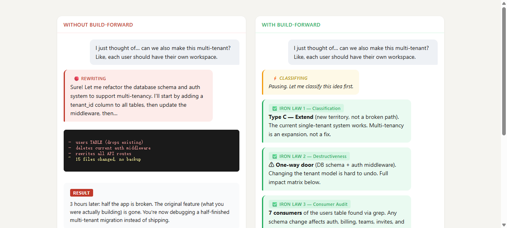
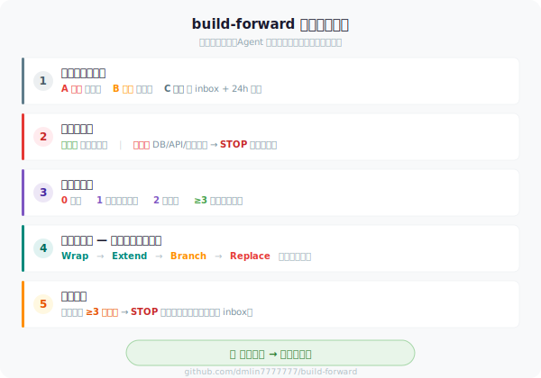

# 三思 (build-forward)

<p align="center">
  <b>Think Thrice Before Acting — Agent's New Idea Firewall.</b>
</p>

<p align="center">
  <a href="https://github.com/dmlin7777777/build-forward/blob/main/LICENSE"></a>
  <a href="SKILL.md"></a>
  <a href="#optimization-history"></a>
  <a href="https://skills.sh/dmlin7777777/build-forward"></a>
</p>

<p align="center">
  <a href="#before--after">Demo</a> ·
  <a href="#quick-start">Quick Start</a> ·
  <a href="#the-five-iron-laws">Five Laws</a> ·
  <a href="SKILL.md">Full Protocol</a> ·
  <a href="test-prompts.json">Test Scenarios</a>
</p>

---

## What problem does it solve?

Every AI-assisted developer knows the cycle: you're building feature A, a new idea for feature B pops up, the agent rewrites half the codebase to "make room" for B, and now everything is broken. It's not a tooling problem — it's a **discipline** problem. Agents don't have any.

`三思` (build-forward) gives them a five-step decision protocol. When you say *"I just thought of..."* mid-development, instead of bulldozing your working code, the agent pauses, classifies the idea, audits the blast radius, and asks before touching anything. You stay in control.

---

## Before → After

<p align="center">
  
</p>

> The difference is one loaded skill. See [`test-prompts.json`](test-prompts.json) for 8 reproducible scenarios.

---

## Quick Start

**1. Install**

```bash
# OpenClaw / WorkBuddy
openclaw skills install build-forward

# npx (Claude Code / Codex / any runtime)
npx skills add dmlin7777777/build-forward

# Or clone directly
git clone https://github.com/dmlin7777777/build-forward.git ~/.workbuddy/skills/build-forward
```

**2. Start developing normally.** The skill auto-activates when you say:

| Trigger (中文) | Trigger (English) |
|----------------|-------------------|
| "我突然想到…" | "I just thought of…" |
| "要不要顺便…" | "can we also…" |
| "能不能改成…" | "what if we change…" |
| "加个功能…" | "let's also add…" |

**3. First prompt after install.** Say to your agent:

```text
I just thought of... what if we also add a payment system?
```

Your agent should pause, output a C-class classification + 24h cooldown suggestion — not start writing payment code.

**4. More test scenarios** in [`test-prompts.json`](test-prompts.json) and [`examples/`](examples/).

---

## The Five Iron Laws

<p align="center">
  
</p>

**Law 1 — Classify first, don't code.** Every idea gets labeled A (fix — handle now) / B (polish — ask user) / C (extend — inbox + 24h cooldown). The cooldown is deliberate: most feature urges either fade or crystallize.

**Law 2 — Assess destructiveness.** Two-way doors (UI, new fields, new routes) proceed. One-way doors (DB schema, public API, file deletion, global state) → 🔴 CHECKPOINT — show impact matrix, wait for user.

**Law 3 — Consumer audit.** Count call sites before building. 0 = don't build. 1 = inline, no abstraction. 2 = extract, don't generalize. ≥3 = consider an abstraction layer. Kills "building for the future" at the source.

**Law 4 — Choose integration mode.** Lowest destructiveness first: **Wrap** → **Extend** → **Branch** → **Replace** (last resort).

**Law 5 — Duplication alert.** ≥3 copies of the same logic → 🔴 CHECKPOINT. Ask user: consolidate now, or inbox?

> Full protocol with edge cases, self-correction rules, and override paths in [`SKILL.md`](SKILL.md).

---

## Safety

**This skill is a decision protocol, not an execution engine.** It never deletes files, modifies databases, runs shell commands, auto-commits, sends network requests, or makes one-way-door decisions for you. Its maximum blast radius: slightly slower development pace — by design.

---

## Ecosystem

`三思` fills the gap between "what should we build?" and "how do we build it safely?"

| Skill | Role | When |
|-------|------|------|
| `brainstorming` / `grill-me` | Requirements clarification | Before coding starts |
| **`三思`** | **New idea firewall** | **Mid-development, new idea arrives** |
| `ideas-inbox` | B/C-class archive + cooldown tracking | After classification |
| `vibecoding-workflow` | Execution discipline | After integration path is chosen |
| `incremental-implementation` | Steady, step-by-step execution | Known requirements, how to execute safely |

The pipeline: **brainstorming → 三思 → ideas-inbox → vibecoding-workflow / incremental-implementation**

---

## Optimization History

| Date | Version | Score | Method |
|------|---------|-------|--------|
| 2026-06-15 | v1.2.0 | 81 (independent) | Luban Plan B — craft polish |
| 2026-06-15 | v1.1.0 | 82 (estimated) | Luban 8-step polish |
| 2026-05-31 | v1.0.0 | 79.6 → 85.0 | Darwin Skill 9-dim optimization |

---

## Contributing

1. **Found an edge case?** Open an issue with the scenario
2. **Have a test case?** Add it to [`test-prompts.json`](test-prompts.json)
3. **Want to improve the protocol?** Read [`SKILL.md`](SKILL.md), then open a PR

---

## License

MIT © [dmlin7777777](https://github.com/dmlin7777777)
