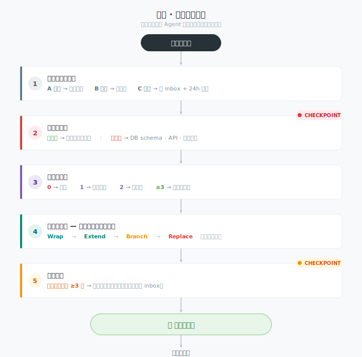

# build-forward

<p align="center">
  <b>Agent's New Idea Firewall — classify, don't rewrite.</b>
</p>

<p align="center">
  <a href="https://github.com/dmlin7777777/build-forward/blob/main/LICENSE"></a>
  <a href="SKILL.md"></a>
  <a href="#optimization-history"></a>
</p>

<p align="center">
  <a href="#before--after">Demo</a> ·
  <a href="#quick-start">Quick Start</a> ·
  <a href="#how-it-works">How It Works</a> ·
  <a href="SKILL.md">Full Protocol</a> ·
  <a href="test-prompts.json">Test Scenarios</a>
</p>

---

## What is this?

**AI agents default to rewriting when a new idea appears. `build-forward` stops that.**

It's a five-step decision protocol loaded as a skill. When you say *"I just thought of..."* mid-development, instead of bulldozing your working code, the agent pauses, classifies the idea, audits the blast radius, and asks before touching anything. You stay in control. The working code stays working.

---

## Before → After

**Without `build-forward`** (what most agents do):

```
User: "I just thought of... can we also add real-time collaboration?"
Agent: "Great idea! Let me rewrite the CRUD endpoints to use WebSockets..."
       [Starts refactoring auth layer, changes DB schema, breaks existing API]

User: "Wait, I just wanted to finish the basic blog first..."
Agent: [Already 3 files deep into WebSocket integration]
```

**With `build-forward`** (what your agent does now):

```
User: "I just thought of... can we also add real-time collaboration?"
Agent: "[build-forward] 分类: C 类（扩展功能，新场景）
       建议进 inbox 并 24 小时冷却。实时协作涉及 WebSocket、
       OT 算法、DB schema 变更——这是单向门改动。
       继续当前博客 CRUD 开发？"

User: "Yeah, let's finish the blog first."
Agent: [Continues blog CRUD without interruption]
```

> The difference is one loaded skill. See [`test-prompts.json`](test-prompts.json) for 8 reproducible scenarios.

---

## Why build-forward?

Every AI-assisted developer knows the cycle: you're building feature A, a new idea for feature B pops up, the agent rewrites half the codebase to "make room" for B, and now everything is broken. It's not a tooling problem — it's a **discipline** problem. Agents don't have any.

`build-forward` gives them a protocol:

| Problem | What build-forward does |
|---------|------------------------|
| Agent jumps to code instead of thinking | **Classify first** — every idea gets a label (A/B/C) before a single line changes |
| Agent bulldozes working features to "make room" | **Audit consumers** — count call sites before building anything |
| Agent treats all changes as equal | **Assess destructiveness** — one-way doors get a checkpoint pause |
| Agent over-abstracts "for the future" | **Count before extracting** — 0 consumers = don't build; 1 = inline |
| Agent churns on the same pattern repeatedly | **Duplication alert** — ≥3 copies triggers a stop-and-ask |

---

## Quick Start

**1. Install**

```bash
# OpenClaw / WorkBuddy
openclaw skills install build-forward

# Or clone directly
git clone https://github.com/dmlin7777777/build-forward.git ~/.workbuddy/skills/build-forward
```

**2. Start developing normally.** The skill auto-activates when you say:

| Trigger (中文) | Trigger (English) |
|----------------|-------------------|
| "我突然想到…" | "I just thought of…" |
| "要不要顺便…" | "can we also…" |
| "能不能改成…" | "what if we change…" |
| "加个功能…" | "let's also add…" |

**3. Your agent now pauses, classifies, and suggests** — instead of rewriting.

**4. Verify it works:** mid-feature, say *"what if we also add a payment system?"* Your agent should respond with a C-class classification and a 24h cooldown suggestion.

---

## How It Works



---

## The Five Iron Laws

### Law 1 — Classify First, Don't Code

| Type | Criteria | Default Action |
|------|----------|----------------|
| **A — Fix** | Breaks current main path; must fix | Handle now → Law 2 |
| **B — Polish** | Better UX, but works today | Ask user: now or inbox? |
| **C — Extend** | New feature / scenario | Inbox + 24h cooldown |

The 24-hour cooldown is deliberate: most feature urges either fade or crystallize.

### Law 2 — Assess Destructiveness

| Door type | Examples | Action |
|-----------|----------|--------|
| **Two-way** (reversible) | UI tweak, new field, new function, new route | Proceed |
| **One-way** (hard to reverse) | DB schema, public API, file deletion, global state, core deps | 🔴 **CHECKPOINT** — show impact matrix, wait for user |

### Law 3 — Consumer Audit

Count call sites before building anything.

| Consumers | Action |
|-----------|--------|
| **0** | Don't build |
| **1** | Inline — no abstraction |
| **2** | Extract — don't generalize |
| **≥3** | Consider an abstraction layer |

Kills "building for the future" before it starts.

### Law 4 — Choose Integration Mode

Pick lowest-destructiveness path:

**Wrap** → **Extend** → **Branch** → **Replace** (last resort)

### Law 5 — Duplication Alert

≥3 copies of the same logic → 🔴 **CHECKPOINT**. Ask user: consolidate now, or inbox?

> Full protocol with edge cases and self-correction rules in [`SKILL.md`](SKILL.md).

---

## Safety

**This skill is a decision protocol, not an execution engine.** It never deletes files, modifies databases, runs shell commands, auto-commits, sends network requests, or makes one-way-door decisions for you. Its maximum blast radius: slightly slower development pace — by design.

---

## Ecosystem

`build-forward` fills the gap between "what should we build?" and "how do we build it safely?"

| Skill | Role | When |
|-------|------|------|
| `brainstorming` / `grill-me` | Requirements clarification | Before coding starts |
| **`build-forward`** | **New idea firewall** | **Mid-development, new idea arrives** |
| `ideas-inbox` | B/C-class archive + cooldown tracking | After classification |
| `vibecoding-workflow` | Execution discipline | After integration path is chosen |
| `incremental-implementation` | Steady, step-by-step execution | Known requirements, how to execute safely |

The pipeline: **brainstorming → build-forward → ideas-inbox → vibecoding-workflow / incremental-implementation**

---

## Optimization History

| Date | Version | Score | Method |
|------|---------|-------|--------|
| 2026-06-15 | v1.1.0 | 66 → 82 | Luban (鲁班) 8-step polish |
| 2026-05-31 | v1.0.0 | 79.6 → 85.0 | Darwin Skill 9-dim optimization |

---

## Contributing

1. **Found an edge case?** Open an issue with the scenario
2. **Have a test case?** Add it to [`test-prompts.json`](test-prompts.json)
3. **Want to improve the protocol?** Read [`SKILL.md`](SKILL.md), then open a PR

---

## License

MIT © [dmlin7777777](https://github.com/dmlin7777777)
